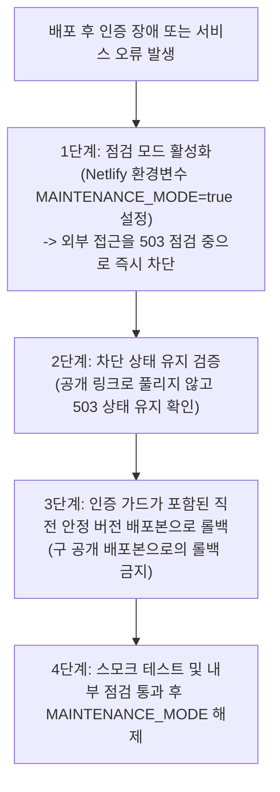

# ANT-003 — 직원 접근 통제 및 내부 아카이브 보안 설계서 (보완 2차)

- **작업 ID**: ANT-003a
- **설계 담당**: 아난티 (Antigravity, Google Pro)
- **메인 오케스트레이터**: 벤 (Ben)
- **작업 브랜치**: `antigravity/ANT-003a-staff-archive-design`
- **기준 커밋**: `origin/master` (`edb6f62`, BEN-013 기준)
- **작성 일자**: 2026-10-02
- **문서 상태**: PR #26 벤 설계 검토(Issue Comment ID `5943294623`) 피드백 8개 항목 전수 반영 보완 설계서 (코드 미수정, 순수 문서 PR)

---

## 1. 개요 및 설계 목적

본 문서는 `BEN-008`(공개 범위·아카이브·배포 결정), `BEN-010`(접근 권한 판단), `BEN-013`(직원 접근 설계와 배포 보강), 그리고 PR #26의 벤 검토 의견에 따라,
봉플레이 운영시스템(`01_봉플레이_운영시스템/`) 및 업무로그·AI(`04_봉뜨락_업무로그_AI/`) 전반의 **직원 전용 자산(Google Drive 5TB 미디어 아카이브, 운영 업무로그 시트, 경영 실적 원장)**에 대한 **서버 검증 기반 접근 통제(Access Control) 및 비공개 자료 안전 제공 체계**를 수립하는 것을 목적으로 한다.

### 1.1 핵심 문제의식
1. **클라이언트 사이드 게스트 모드의 한계**: `01` 운영시스템의 `BongplayAuth`는 브라우저 UI를 가리는 프론트엔드 오버레이 방식에 불과하여, 네트워크 API 직접 호출이나 로컬 스토리지 조작을 원천 차단하지 못함.
2. **04 API의 구조적 취약점**:
   - `04_봉뜨락_업무로그_AI/netlify/functions/api.mjs`의 `checkAccess()`는 `ACCESS_CODE` 환경변수가 비어있으면 모든 요청을 무검증 통과시킴.
   - `GET /api/config`는 인증 전 누구나 볼 수 있는 응답에 비공개 Google 시트 원본 편집 주소(`sheetUrl`)를 그대로 누출함.
3. **Google Apps Script(GAS)의 전면 공개 권한 및 잠재적 리스크**:
   - `01_봉플레이_운영시스템/assets/drive-archive.gs` 소스코드 상에서 업로드 파일 및 생성 폴더에 `DriveApp.Access.ANYONE_WITH_LINK` 공개 권한을 부여하도록 작성되어 있음.
   - 소스코드에 인증 가드 없는 `doPost(action=delete)` 및 루트 폴더 범위 검증 누락이 존재하여 파일 ID 조작 위험이 있음 (라이브 배포 상태의 삭제 동작 여부는 별도 검증 대상).
4. **외부 우회 링크 및 공용 단말기 위험**:
   - 매장 내 공용 키오스크/태블릿에서 관리자 권한이 상시 노출되거나, 브라우저 캐시(bfcache)/뒤로가기로 비공개 자료가 노출될 수 있음.

---

## 2. 현행 시스템 취약점 및 서버 계약 정밀 분석 (코드 근거)

### 2.1 04 Netlify Functions (`04_봉뜨락_업무로그_AI/netlify/functions/api.mjs`)

```javascript
// [api.mjs line 920-924] ACCESS_CODE 미설정 시 인증 무조건 통과 (실제 취약점 1)
function checkAccess(env, code) {
  const expected = String(env.ACCESS_CODE || '').trim();
  if (!expected) return; // 구조적 허점: 환경변수 누락 시 모든 보안 검사 생략
  if (String(code || '').trim() !== expected) throw new UserError('접근 코드가 올바르지 않습니다.', 401);
}

// [api.mjs line 940-952] unauthenticated GET /api/config 에서 sheetUrl 선반환 (실제 취약점 2)
if (action === 'config') {
  return json({
    needsAccessCode: Boolean(String(env.ACCESS_CODE || '').trim()),
    sheetUrl: sheetUrl(env), // 구조적 허점: 미인증 상태에서 비공개 스프레드시트 편집 URL 직접 누출
    ...
  });
}

// [api.mjs line 954-957 및 990-992] rows 요청의 실제 처리 위치 (정정 보고)
if (request.method !== 'POST') return json({ error: '지원하지 않는 요청입니다.' }, 405);
const payload = await request.json().catch(() => ({}));
checkAccess(env, payload.code); // rows는 POST 메서드 제한 및 checkAccess 뒤에 위치함

if (action === 'rows') {
  return json({ rows: await readRows(env), sheetUrl: sheetUrl(env) });
}
```

- **정정 및 재분석**:
  - **`rows` 요청의 위치**: `api.mjs`에서 `action === 'rows'`는 `request.method !== 'POST'` 검사와 `checkAccess(env, payload.code)`를 통과한 이후에 실행된다. 따라서 "GET rows 인증 누락"이라는 1차 분석은 오류이며, `rows`는 POST 요청 시 `checkAccess`의 통제를 받는다.
  - **실제 문제점**:
    1. `ACCESS_CODE` 환경변수가 Netlify 대시보드에 설정되지 않은 경우, `checkAccess()`가 아무런 에러 없이 즉시 `return`하므로, 인증 없이 `rows`, `append`, `classify`가 전면 허용된다.
    2. `GET /api/config`는 POST 검사 이전에 무인증으로 응답하므로, 비공개 Google Spreadsheet URL(`https://docs.google.com/spreadsheets/d/${env.SHEET_ID}/edit`)이 인터넷상에 무방비로 선반환된다.
  - **외부 의존성 원칙**: Netlify Zip 배포 특성상 외부 npm 패키지를 설치하지 않는 원칙(Zero-dependency, Node.js 내장 `node:crypto` 및 `fetch` 사용)을 준수해야 한다.

### 2.2 01 운영시스템 인증 (`01_봉플레이_운영시스템/assets/config.template.js`)

```javascript
// [config.template.js line 99-114] verifyOnServer RPC 호출
function verifyOnServer(code) {
  if (!sbUrl || !sbKey) return Promise.reject(new Error('unconfigured'));
  return fetch(sbUrl + '/rest/v1/rpc/verify_staff_access', {
    method: 'POST',
    headers: { ... },
    body: JSON.stringify({ p_access_code: code })
  }).then(function (res) {
    if (!res.ok) throw new Error('http_' + res.status);
    return res.json();
  }).then(function (ok) { return ok === true; }); // 실제 반환값은 boolean
}
```

- **Supabase RPC 계약 확인 (`FINAL_SUPABASE_SETUP.sql` line 714-721)**:
  ```sql
  create or replace function public.verify_staff_access(p_access_code text)
  returns boolean
  language sql security definer as $$
    select private.verify_access_code(p_access_code);
  $$;
  ```
- **분석**:
  - `verify_staff_access`의 실제 DB 계약은 단일 `access_code`를 bcrypt 검증하여 **단순 `boolean` (`true` / `false`)만 반환**한다.
  - 사용자 식별자(`staff_id`), 역할(`role`), 프로필 등 개인 신원 정보는 일체 반환하지 않는다.
  - 클라이언트 `localStorage`에 평문으로 `{ code, authAt, expiresAt }`를 저장하므로, 서버 측에서 특정 직원의 세션을 선별하여 철회(Revocation)할 수 없다.

### 2.3 Google Apps Script 소스코드 분석 (`01_봉플레이_운영시스템/assets/drive-archive.gs`)

```javascript
// [drive-archive.gs line 124, 151, 161] 소스코드 상의 ANYONE_WITH_LINK 설정
file.setSharing(DriveApp.Access.ANYONE_WITH_LINK, DriveApp.Permission.VIEW);
newRoot.setSharing(DriveApp.Access.ANYONE_WITH_LINK, DriveApp.Permission.VIEW);
newFolder.setSharing(DriveApp.Access.ANYONE_WITH_LINK, DriveApp.Permission.VIEW);

// [drive-archive.gs line 88-103] 소스코드 상의 무인증 delete 핸들러
if (action === 'delete' || action === 'deleteFile') {
  var fileId = payload.fileId;
  ...
  var f = DriveApp.getFileById(fileIds[d]);
  f.setTrashed(true); // 소스코드 상에 인증 검증이 부재함
}
```

- **객관적 위험 평가**:
  - **소스코드 결함**: 소스코드에 `ANYONE_WITH_LINK` 설정 로직 및 인증 가드 없는 `delete` 액션이 작성되어 있어 보안상 매우 위험한 설계 패턴을 보임.
  - **라이브 상태 주의**: 현재 실제 배포된 라이브 GAS 웹 앱(배포 ID/버전 2)에서 삭제가 실제로 동작하는지, 혹은 링크 공유가 활성화되어 있는지는 실측 검증 전까지 단정하지 않는다 (라이브 침투 테스트 금지). 다만 소스코드의 구조적 결함은 이번 설계를 통해 확실히 차단·제거해야 한다.

### 2.4 두 실사용 도메인 및 진입점 경계 (정정)

- **도메인 1 (01 운영시스템)**: `https://bongplay.netlify.app`
- **도메인 2 (04 업무로그/AI)**: `https://bongplaychat.netlify.app` *(구 `bongttrak` 명칭 전면 정정)*
- **문제점**:
  - 두 도메인은 서로 다른 서브도메인이므로 브라우저 보안 정책상 호스트 전용 쿠키(`Host-only Cookie`)가 공유되지 않는다.
  - `Domain=netlify.app` 쿠키 설정은 Public Suffix List(eTLD) 제약으로 인해 브라우저에 의해 전면 거부된다.
  - 따라서 도메인 간 세션 불일치와 SameSite 정책을 해결할 아키텍처적 통합이 필수적이다.

---

## 3. 권한 매트릭스 및 개인 신원 검증 재설계

### 3.1 개인 신원 검증(Authentication)과 서버 역할 부여(Authorization) 분리

공용 암호와 수기 이름 선택 방식은 개인 신원 검증을 전혀 충족하지 못하므로 전면 폐기한다.

1. **개인별 신원 인증 (Identity)**:
   - 각 직원은 고유 식별자(`staff_id`, 예: `sh_hong`, `jy_kim`, `js_park`)와 개인별 비밀번호/PIN으로 신원을 검증받는다.
   - 자가가입(Self-signup)은 일체 불허하며, 승인된 직원 명부만 관리자에 의해 사전 등록된다.
2. **서버 역할 부여 (Server-side Role Mapping)**:
   - 클라이언트 요청을 신뢰하지 않고, 서버(Supabase 또는 Netlify 환경변수/DB)가 보유한 역할 테이블에 따라 역할(`staff`, `admin`)을 결정한다.
3. **서버 측 즉시 철회 (Server-side Revocation)**:
   - 직원의 퇴사, 기기 분실, 권한 박탈 시 서버에서 해당 계정의 `is_active = false` 처리하거나 `token_version`을 증가시켜, 기발급된 세션을 즉시 무효화한다.

### 3.2 4대 행위별 권한 통제 표

| 행위 (Action) | 미인증 / 비직원 | 게스트 (고객) | 현장 직원 (Staff) | 관리자 (Admin) | 차단/허용 구현 메커니즘 |
|---|:---:|:---:|:---:|:---:|---|
| **원장·목록·썸네일·원본 조회**<br>(업무로그 시트, 아카이브 11분류) | ❌ 거부 (401) | ❌ 거부 (401) | ⭕ **허용** | ⭕ **허용** | 서버 서명 JWT 검증 + 서비스 계정 기반 조회 |
| **업무로그 저장·사진 업로드**<br>(행 추가, 신규 사진 등록) | ❌ 거부 (401) | ❌ 거부 (401) | ⭕ **허용** | ⭕ **허용** | 개인 식별자(`staff_id`) 로깅 + 비공개 저장 |
| **파일 삭제 (휴지통 이동)** | ❌ 거부 (401) | ❌ 거부 (401) | ❌ **거부 (403)** | ⭕ **허용** *(방식 미확정)* | 역할 검사(`role === 'admin'`) (대표 답변 대기) |
| **직원 권한 부여 / 비밀번호 변경** | ❌ 거부 (401) | ❌ 거부 (401) | ❌ **거부 (403)** | ⭕ **지정 절차** | 대표 직접 승인 및 관리자 전용 절차 |

> [!NOTE]
> 관리자 강제 마감 해제 등 아직 업무 규칙으로 배정되지 않은 특수 권한은 본 설계의 확정 범위에서 제외한다.

---

## 4. 목표 아키텍처 및 미디어 제공 경로 재설계

### 4.1 GAS ContentService 텍스트 한계와 Google Drive API 제공 경로

- **Google 공식 문서 확인 (`https://developers.google.com/apps-script/guides/content`)**:
  - Google Apps Script의 `ContentService`는 `createTextOutput()` 텍스트만 지원한다 (Text, JSON, XML 등).
  - **바이너리 Blob 스트리밍(Binary stream)을 지원하지 않는다.**
  - 따라서 GAS가 직접 클라이언트나 Netlify에 이미지 바이너리 스트림을 중계한다는 것은 불가능하다.

- **미디어 제공 현실적 대안 비교 및 채택**:

| 비교 항목 | [채택] 방안 1: Netlify Function + Google Drive API v3 (서비스 계정) | [보조] 방안 2: GAS ContentService Base64 JSON 텍스트 반환 |
|---|---|---|
| **제공 경로** | Netlify 함수가 Google 서비스 계정 JWT로 Google Drive API v3 (`files.get?alt=media`) 직접 호출 | GAS 웹 앱이 Blob을 `Utilities.base64Encode()`하여 JSON 텍스트로 Netlify에 반환 |
| **바이너리 스트리밍**| ⭕ **가능** (Node.js Buffer 스트림을 클라이언트에 `image/jpeg` 바이너리로 서빙) | ❌ **불가** (Base64 인코딩된 대용량 JSON 텍스트 파싱 필요) |
| **크기 오버헤드** | 없음 (순수 바이너리) | 33% 팽창 (Base64 인코딩 페널티) |
| **GAS 의존성** | **완전 배제** (GAS 배포 취약점 원천 소멸) | GAS 웹 앱 유지 필요 (호출 한도, 50MB 메모리 제한) |
| **실현 근거** | `api.mjs`에 이미 서비스 계정 키(`GOOGLE_PRIVATE_KEY`)와 JWT 서명 로직 구현 완비 | Google Apps Script ContentService 공식 스펙 부합 |

- **결론**: 비공개 미디어 조회의 주 경로는 `api.mjs`의 검증된 Google 서비스 계정을 통해 **Google Drive API v3를 직접 호출하여 바이너리를 서빙하는 아키텍처**로 전환한다.

### 4.2 Netlify 플랜 미확인 및 공식 제한에 따른 범위 산정

- **Netlify 플랜 현황**: 현재 팀의 실제 요금제 플랜(Free Starter vs Pro/Team)은 공식 확인되지 않았다. 따라서 100GB 무료 가정을 배제하고 공식 스펙에 따른 한계를 준수한다.
- **공식 함수 한도 ([Netlify Functions Overview](https://docs.netlify.com/build/functions/overview/))**:
  - **동기 함수 실행 시간**: 기본 10초 (최대 26초 연장 가능하나 기본 10초 권장).
  - **요청 / 응답 본문 크기 제한**: **최대 6MB**.
  - **함수 번들 크기 제한**: 50MB(압축) / 250MB(비압축).
- **미디어 제공 범위 산정**:
  - **썸네일 및 웹 최적화 이미지 (< 5MB)**: Netlify Function 프록시 스트림을 통해 안전하게 서빙 (10초 실행 시간 및 6MB 응답 제한 완전 준수).
  - **대용량 원본 파일 (5MB 초과 사진/영상)**: Netlify 동기 응답 버퍼(6MB)를 초과하므로 단순 프록시 스트리밍이 불가능함.
  - **5분 Drive 서명 URL 주의**: Google Drive API는 S3/GCS 같은 Pre-signed URL API를 제공하지 않으므로, 실현성 검토 및 권한 경계 입증 전까지 확정하지 않는다. 5MB 초과 원본 제공 방식은 **벤 검토 대기 항목**으로 격리한다.

### 4.3 서버 간 인증(Server-to-Server) 비밀키 비노출 설계

- **GET 쿼리 스트링 비밀키 전달 제거**:
  - `?secret=...` 방식은 웹 서버 액세스 로그, CDN 프록시 로그, 브라우저 히스토리에 시크릿이 영구 기록되므로 전면 금지한다.
- **HTTP Authorization 헤더 전송**:
  - Netlify 함수와 백엔드/GAS 간 통신 시 반드시 HTTP Request Header를 사용한다:
    ```http
    Authorization: Bearer <ARCHIVE_SHARED_SECRET>
    X-Client-Request-Id: <uuid>
    ```

---

## 5. 도메인 통합, 세션 보안 및 차단 유지 복구

### 5.1 두 호스트 간 쿠키 경계 해결: 단일 출처 API 통합 (Proxy Rewrite)

`bongplay.netlify.app`과 `bongplaychat.netlify.app` 간의 쿠키 공유 불가 문제를 해결하기 위해, Netlify의 **Same-Origin Proxy Rewrite**를 공식 채택한다:

1. `01_봉플레이_운영시스템/netlify.toml` 또는 `_redirects` 파일에 리라이트 선언:
   ```text
   # [bongplay.netlify.app/_redirects]
   /api/*  https://bongplaychat.netlify.app/api/:splat  200!
   ```
2. **동작 효과**:
   - 브라우저는 모든 API 요청을 동일 출처인 `https://bongplay.netlify.app/api/*`로 호출한다.
   - 쿠키는 `bongplay.netlify.app`의 단일 호스트 쿠키(`Host-only`)로 발급되며, Cross-Origin 및 SameSite 제약이 완벽하게 소멸한다.
   - 운영 허용 Origin은 `https://bongplay.netlify.app` 및 `https://bongplaychat.netlify.app` 2개로만 고정하며, `localhost` 와일드카드는 운영 코드에 일체 포함하지 않는다.

### 5.2 디지털 서명 토큰(JWS) 및 서버 측 즉시 철회(Revocation) 체계

> [!NOTE]
> 본 토큰은 HMAC-SHA256으로 위변조를 검증하는 **디지털 서명 토큰(Signed Token, JWS)**이며, 페이로드를 암호화한 JWE가 아니므로 민감한 비밀값을 토큰 페이로드에 담지 않는다.

1. **토큰 Claims 구성**:
   ```json
   {
     "sub": "sh_hong",         // 직원 고유 식별자 (개인별)
     "role": "staff",           // "staff" | "admin"
     "token_version": 1,        // 서버 측 철회용 버전 번호
     "jti": "b8f2...9a1",       // 토큰 고유 UUID
     "iat": 1759363200,
     "exp": 1759406400          // 12시간 (43200초)
   }
   ```
2. **서버 측 즉시 철회 메커니즘**:
   - 쿠키 삭제(`Max-Age=0`)만으로는 유출된 토큰의 재사용을 막을 수 없다.
   - **서버 검증 규칙**:
     - 직원의 권한 박탈/퇴사/비밀번호 변경 시 서버 저장소의 `token_version`을 증가시킨다.
     - Netlify Function은 API 호출 시 토큰의 `token_version`이 서버의 현재 버전과 일치하는지, 혹은 `jti`가 로그아웃 블랙리스트에 있는지 검사하여 불일치 시 401 Unauthorized로 즉시 거부한다.
3. **bfcache (Back-Forward Cache) 노출 차단**:
   - `location.replace`만으로는 브라우저 메모리의 bfcache 노출을 막지 못한다.
   - **대책 1**: 모든 직원 응답에 `Cache-Control: no-store, no-cache, must-revalidate, private` 필수 적용.
   - **대책 2**: 직원 페이지에 `pageshow` 이벤트 리스너를 장착하여 캐시 복원 시 세션을 강제 재검증:
     ```javascript
     window.addEventListener('pageshow', function(event) {
       if (event.persisted) {
         // bfcache에서 복원된 경우 세션 쿠키 검증을 위해 즉시 새로고침/재확인
         fetch('/api/auth/session-check').then(res => {
           if (!res.ok) window.location.reload();
         });
       }
     });
     ```

### 5.3 허용 루트 검사 고도화 (깊이·사이클·Shortcut 방어)

단순 2단계 부모 검사는 깊은 하위 폴더(`루트/01_분류/2026-10/sub/file.jpg`)를 누락하며 순환 참조에 취약하다.

```javascript
/**
 * 파일이 공식 아카이브 루트 폴더 하위에 안전하게 속해있는지 검증
 * @param {GoogleAppsScript.Drive.File} file 
 * @param {string} rootFolderId 
 * @returns {boolean}
 */
function isFileInArchiveRoot(file, rootFolderId) {
  var MAX_DEPTH = 6;
  var visited = {};
  var currentFolders = [];
  
  // Shortcut 파일 방어: 바로가기 파일은 보안상 아카이브 처리 대상에서 제외
  if (file.getMimeType() === 'application/vnd.google-apps.shortcut') {
    return false;
  }

  var parents = file.getParents();
  while (parents.hasNext()) {
    currentFolders.push(parents.next());
  }

  var depth = 0;
  while (currentFolders.length > 0 && depth < MAX_DEPTH) {
    var nextLevel = [];
    for (var i = 0; i < currentFolders.length; i++) {
      var folder = currentFolders[i];
      var fId = folder.getId();
      
      if (fId === rootFolderId) return true; // 루트 발견!
      
      // 순환 참조(Cycle) 방어
      if (visited[fId]) continue;
      visited[fId] = true;
      
      var p = folder.getParents();
      while (p.hasNext()) {
        nextLevel.push(p.next());
      }
    }
    currentFolders = nextLevel;
    depth++;
  }
  return false; // 최대 깊이 내에 루트를 찾지 못함 (비인가 파일)
}
```

### 5.4 차단 유지 복구 순서 (Fail-Closed Rollback)

이전 공개 버전으로 단순 롤백하면 무인증 API와 `ANYONE_WITH_LINK`가 다시 활성화되어 보안 통제가 즉시 무너진다.
따라서 장애 발생 시 반드시 **차단 상태를 유지하는 복구 절차(Fail-Closed)**를 수행한다:



---

## 6. 고객 공개 화면 및 기존 원본 데이터 보존

1. **고객 공개 4대 화면 완전 격리**:
   - `pages/consent.html`, `pages/booking.html`, `pages/survey.html`, `index.html`은 `BONGPLAY_GUEST_MODE = true`를 유지하며 이번 직원 접근 통제 변경의 영향을 일체 받지 않음.
2. **11개 아카이브 분류 체계 및 5TB 원본 보존**:
   - 드라이브 내 기존 11개 분류 폴더와 원본 파일은 그대로 보존하며, 복사/이동/재적재를 일체 수행하지 않음.

---

## 7. 벤(Ben) 및 대표 판단 필요 사항 (정리)

### 7.1 대표 판단 필요 사항 (정책 대기)
- **[대표 정책 1] 관리자 파일 삭제 정책 확정**: 휴지통 이동(30일 보존) vs 영구 삭제 승인 절차 (현재 대표 답변 대기 중).
- **[대표 정책 2] 비공개 아카이브 내 연락처/개인정보 노출 정책**: 고객 얼굴 및 서약서 내 연락처 마스킹 수준 확정.

### 7.2 벤(Ben) 검토 필요 사항 (기술 실현성)
- **[벤 기술 검토 1] 5MB 초과 대용량 원본 파일 제공 방식**: Netlify 6MB 제한에 따른 대용량 원본 미디어의 안전한 제공 방안(Google Drive 내부 공유 vs 전용 백엔드 파이프라인).
- **[벤 기술 검토 2] 개인별 자격증명 DB 스키마 승인**: Supabase 내 `staff_users` 테이블 추가 DDL 또는 `verify_individual_staff` RPC 인터페이스 확정.
