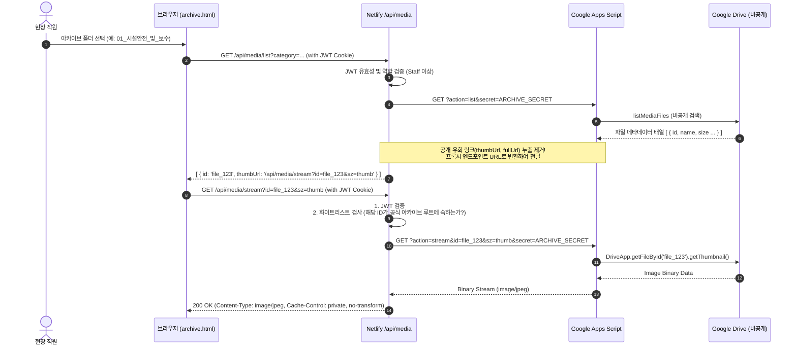

# ANT-003 — 직원 접근 통제 및 내부 아카이브 보안 설계서

- **작업 ID**: ANT-003a
- **설계 담당**: 아난티 (Antigravity, Google Pro)
- **메인 오케스트레이터**: 벤 (Ben)
- **작업 브랜치**: `antigravity/ANT-003a-staff-archive-design`
- **기준 커밋**: `origin/master` (`edb6f62`, BEN-013 기준)
- **작성 일자**: 2026-10-02
- **문서 상태**: 벤 검토 및 대표 결정 요청을 위한 1차 상세 설계서 (코드 미수정, 순수 문서 PR)

---

## 1. 개요 및 설계 목적

본 문서는 `BEN-008`(공개 범위·아카이브·배포 결정), `BEN-010`(접근 권한 판단), `BEN-013`(직원 접근 설계와 배포 보강)에 따라,
봉플레이 운영시스템(`01_봉플레이_운영시스템/`) 및 업무로그·AI(`04_봉뜨락_업무로그_AI/`) 전반의 **직원 전용 자산(Google Drive 5TB 미디어 아카이브, 운영 업무로그 시트, 경영 실적 원장)**에 대한 **서버 검증 기반 접근 통제(Access Control) 및 비공개 자료 안전 제공 체계**를 수립하는 것을 목적으로 한다.

### 1.1 핵심 문제의식
1. **클라이언트 사이드 게스트 모드의 한계**: `01` 운영시스템의 `BongplayAuth`는 브라우저 UI를 가리는 오버레이 방식에 불과하여, 네트워크 API 직접 호출이나 스토리지 조작을 차단하지 못함.
2. **04 API 무인증 및 비공개 시트 URL 노출**: `04_봉뜨락_업무로그_AI/netlify/functions/api.mjs`는 `ACCESS_CODE` 환경변수가 비어있으면 모든 요청을 무검증 통과시키며, `/api/config`는 인증 전 누구나 볼 수 있는 응답에 비공개 Google 시트 원본 주소(`sheetUrl`)를 그대로 누출함.
3. **Google Apps Script(GAS)의 전면 공개 권한 및 임의 삭제 위험**: `01_봉플레이_운영시스템/assets/drive-archive.gs`는 웹 앱이 "모든 사용자(익명 포함)" 권한으로 배포되어 있고, 모든 업로드 파일 및 폴더에 `ANYONE_WITH_LINK` 공개 권한을 부여하며, 인증 없는 `doPost(action=delete)`로 임의 파일 ID 삭제가 가능함.
4. **외부 우회 링크 및 공용 단말기 위험**: 매장 내 공용 키오스크/태블릿에서 관리자 비밀번호가 직원 및 손님에게 노출되거나, 브라우저 캐시/뒤로가기로 비공개 자료가 노출될 수 있음.

---

## 2. 현행 시스템 취약점 및 서버 계약 분석 (코드 근거)

### 2.1 04 Netlify Functions (`04_봉뜨락_업무로그_AI/netlify/functions/api.mjs`)

```javascript
// [api.mjs line 920-924] ACCESS_CODE 미설정 시 인증 무조건 통과
function checkAccess(env, code) {
  const expected = String(env.ACCESS_CODE || '').trim();
  if (!expected) return; // 취약점: 환경변수 누락 시 모든 검사 생략
  if (String(code || '').trim() !== expected) throw new UserError('접근 코드가 올바르지 않습니다.', 401);
}

// [api.mjs line 940-952] unauthenticated GET /api/config 에서 sheetUrl 직접 반환
if (action === 'config') {
  return json({
    needsAccessCode: Boolean(String(env.ACCESS_CODE || '').trim()),
    sheetUrl: sheetUrl(env), // 취약점: 미인증 상태에서 비공개 스프레드시트 편집 URL 직접 반환
    ...
  });
}

// [api.mjs line 990-992] GET /api/rows 에 인증 검증 누락
if (action === 'rows') {
  return json({ rows: await readRows(env), sheetUrl: sheetUrl(env) }); // 취약점: 누구나 시트 원장 전체 조회 가능
}
```

- **분석**:
  - `checkAccess`는 POST 요청 시 요청 본문의 `code`만 검사하며, 세션이나 만료 시간이 없음.
  - `GET /api/config`와 `GET /api/rows`는 `checkAccess` 호출 자체가 누락되어 있어 인터넷상의 누구나 원본 업무로그 전체 행과 비공개 Google Sheet 주소를 탈취할 수 있음.
  - 외부 패키지 0개(`node:crypto`, `fetch`만 사용) 원칙이 적용되어 있으므로, 신규 설계도 외부 종속성 없이 경량으로 구성해야 함.

### 2.2 01 운영시스템 인증 (`01_봉플레이_운영시스템/assets/config.template.js`)

```javascript
// [config.template.js line 87-97] 클라이언트 사이드 경로 판별
var path = window.location.pathname.toLowerCase();
var isPortalRoot = path.indexOf('/pages/') === -1 && path.indexOf('/forms/') === -1 &&
                   (/\/$/.test(path) || /\/index\.html$/.test(path));
if (window.BONGPLAY_GUEST_MODE === true || isPortalRoot) return;
if (readSession()) return;
```

- **분석**:
  - 클라이언트 JavaScript에서 `window.BONGPLAY_GUEST_MODE = true` 여부만 검사하여 UI를 표시/숨김 처리함.
  - 세션 정보(`bongplay_staff_session_v2`)가 `localStorage`에 평문 JSON(`{ code, authAt, expiresAt }`)으로 보관되어 XSS 취약점 발생 시 탈취 가능.
  - 서버단(Netlify Function 또는 Supabase REST)에서 해당 요청이 실제 유효한 직원 세션에서 온 것인지 검증하는 Authorization 헤더 연동이 미비함.

### 2.3 현행 Google Apps Script (`01_봉플레이_운영시스템/assets/drive-archive.gs`)

```javascript
// [drive-archive.gs line 121-125] 파일 업로드 시 ANYONE_WITH_LINK 공개 공유 강제 부여
var blob = Utilities.newBlob(Utilities.base64Decode(base64Data), mimeType, filename);
var file = monthFolder.createFile(blob);
file.setDescription("[작성자: " + uploader + "] " + memo + " ...");
file.setSharing(DriveApp.Access.ANYONE_WITH_LINK, DriveApp.Permission.VIEW); // 취약점: 공개 링크 생성

// [drive-archive.gs line 88-103] 무인증 파일 삭제(휴지통 이동) 허용
if (action === 'delete' || action === 'deleteFile') {
  var fileId = payload.fileId;
  ...
  var f = DriveApp.getFileById(fileIds[d]);
  f.setTrashed(true); // 취약점: 인증 없이 fileId만 보내면 즉시 삭제
}

// [drive-archive.gs line 229-232] 공개 우회 썸네일 URL 클라이언트 노출
thumbUrl: "https://drive.google.com/thumbnail?sz=w600&id=" + f.getId(),
fullUrl: "https://drive.google.com/thumbnail?sz=w1600&id=" + f.getId()
```

- **분석**:
  - `doGet`과 `doPost` 어디에도 API 키나 호출자 신원 확인 로직이 없음.
  - 웹 앱 URL(`.../exec`)을 알면 누구나 임의 파일 ID를 휴지통으로 보낼 수 있으며, 계정 내 임의 폴더를 생성할 수 있음.
  - `ANYONE_WITH_LINK`로 공개된 파일은 Google 검색 로봇에 수집되거나 링크 유출 시 개인정보(고객 얼굴 사진, 사고 보고서 등)가 영구 노출됨.
  - `DriveApp.getFileById(id)` 호출 시 해당 파일이 `봉플레이_공식아카이브` 폴더 내에 속하는지 검증하지 않아, 소유자 드라이브의 개인 문서 ID가 전달되면 그대로 조작 위험이 발생함.

### 2.4 두 실사용 도메인 및 진입점 경계 현황

- **도메인 1 (`bongplay.netlify.app`, 01 운영시스템)**:
  - 매표(POS), 출입 게이트, 안전점검, 마감정산 등 현장 운영 핵심 허브.
  - `pages/archive.html`이 존재하지만 현행 코드는 구 도메인(`04`)의 GAS URL을 직접 호출하도록 분기되어 있음.
- **도메인 2 (`bongttrak.netlify.app`, 04 업무로그/AI)**:
  - 봉챗(업무로그) 및 구 아카이브(`public/archive.html`), Netlify Functions(`/api/*`) 호스팅.
  - 두 도메인 간 세션 공유가 되지 않으며, 사용자가 어느 화면에서 로그인하든 다른 화면에서 다시 비밀번호를 요구하거나 인증이 우회되는 분절 현상 발생.

---

## 3. 권한 매트릭스 및 역할 정의 (Role & Permission Matrix)

### 3.1 4개 역할 정의

1. **미인증 / 비직원 (Unauthenticated / Public)**:
   - 로그인하지 않은 일반 방문자 또는 세션이 만료된 사용자.
2. **게스트 (Guest - 고객 및 단체 인솔자)**:
   - 안전서약서 작성(`consent.html`), 모바일 만족도 설문(`survey.html`), 단체 견학 예약(`booking.html`)을 이용하는 고객.
   - 공개된 정적 폼 화면만 접근 가능하며, 시스템 원장이나 직원 기능 접근 불가.
3. **현장 직원 (Staff - 운영/매표/안전 요원)**:
   - 인증된 현장 근무자.
   - 매표, 출입 게이트, 안전점검, 마감정산, 업무로그 조회/작성, 현장 사진/영상 업로드 및 비공개 열람 가능.
   - **삭제 권한 없음** (공용 단말 오작동 또는 악의적 삭제 방지).
4. **관리자 (Admin - 대표/총괄 매니저)**:
   - 지정된 보안 관리자.
   - 직원의 모든 권한 + 파일 휴지통 이동(삭제), 권한 관리, 원장 강제 마감 해제 등 특수 권한 보유.

### 3.2 4대 핵심 행위별 권한 표

| 행위 (Action) | 미인증 / 비직원 | 게스트 (고객) | 현장 직원 (Staff) | 관리자 (Admin) | 차단/허용 구현 메커니즘 |
|---|:---:|:---:|:---:|:---:|---|
| **원장·목록·썸네일·원본 조회**<br>(업무로그 시트, 아카이브 11분류) | ❌ 거부 (401) | ❌ 거부 (401) | ⭕ **허용** | ⭕ **허용** | 서버 세션 토큰 검증 + Netlify 미디어 스트림 프록시 |
| **업무로그 저장·사진 업로드**<br>(행 추가, 신규 사진 등록) | ❌ 거부 (401) | ❌ 거부 (401) | ⭕ **허용** | ⭕ **허용** | 서버 서명 토큰 검증 + 업로드 시 `setSharing` 완전 차단 |
| **파일 삭제 (휴지통 이동)** | ❌ 거부 (401) | ❌ 거부 (401) | ❌ **거부 (403)** | ⭕ **허용** | 역할 검사(`role === 'admin'`) + 2단계 확인 절차 |
| **직원 권한 부여 / 비밀번호 변경** | ❌ 거부 (401) | ❌ 거부 (401) | ❌ **거부 (403)** | ⭕ **지정 절차** | 대표 직접 승인(환경변수/Supabase 관리자 콘솔) |

### 3.3 신원 검증(Identity)과 역할 부여(Authorization) 분리 원칙

1. **자가가입(Self-signup) 완전 금지**:
   - 공개 폼을 통한 계정 생성이나 셀프 승격 경로는 일체 두지 않는다.
2. **클라이언트 플래그 신뢰 금지**:
   - `localStorage`의 `isAdmin: true`나 브라우저 전역 변수 조작은 무효하며, 모든 역할 판정은 서버(Netlify Function / Supabase RPC)에서 서명된 암호화 토큰에 의해서만 결정된다.
3. **공용 단말기 패스워드 공유 방지**:
   - 현장 단말기에는 일반 직원용 PIN/패스워드만 입력하며, 관리자 패스워드는 공용 태블릿에 상시 저장하거나 공유하지 않는다.

---

## 4. 목표 아키텍처 및 요청 흐름 (Target Architecture & Request Flow)

### 4.1 시스템 구성도

```mermaid
flowchart TD
    subgraph Client["클라이언트 브라우저 (태블릿 / 모바일 / 데스크톱)"]
        GuestView["고객 공개 화면\n(consent / booking / survey)"]
        StaffPortal["통합 운영 포털\n(01 pages/* & archive.html)"]
    end

    subgraph Netlify["보안 서버리스 게이트웨이 (Netlify Functions)"]
        AuthFn["/api/auth\n(직원/관리자 인증 & JWT 쿠키 발급)"]
        WorklogFn["/api/worklog\n(업무로그 조회·분류·적재)"]
        MediaProxy["/api/media\n(Drive 비공개 미디어 스트리밍 프록시)"]
    end

    subgraph Backend["비공개 원본 스토리지 & 서비스"]
        Supabase[("Supabase DB / RPC\n(직원 암호 검증 & 운영 원장)")]
        GoogleSheets[("Google Spreadsheet\n(비공개 업무로그 원본)")]
        GoogleDrive[("Google Drive 5TB\n(비공개 공식 아카이브 루트)")]
        SecureGAS["Apps Script (비공개 실행)\n(X-Archive-Secret 검증)"]
    end

    GuestView -.->|인증 불필요| Client
    StaffPortal -->|1. 로그인 요청| AuthFn
    AuthFn -->|검증 RPC| Supabase
    AuthFn -.->|HttpOnly JWT 발급| StaffPortal

    StaffPortal -->|2. 업무로그 요청 (JWT 포함)| WorklogFn
    WorklogFn -->|서비스 계정 JWT| GoogleSheets

    StaffPortal -->|3. 미디어/썸네일 요청 (JWT 포함)| MediaProxy
    MediaProxy -->|루트 화이트리스트 검사| SecureGAS
    SecureGAS -->|비공개 Blob 스트림| MediaProxy
    MediaProxy -->|바이너리 이미지 서빙| StaffPortal
```

### 4.2 직원 로그인 및 세션/토큰 발급 흐름

```mermaid
sequenceDiagram
    autonumber
    actor Staff as 현장 직원
    participant Browser as 브라우저 (BongplayAuth)
    participant Netlify as Netlify /api/auth
    participant Supabase as Supabase RPC

    Staff->>Browser: 직원 암호 입력 (6자 이상)
    Browser->>Netlify: POST /api/auth/login { code }
    Netlify->>Supabase: rpc/verify_staff_access { p_access_code: code }
    
    alt 인증 성공 (Staff)
        Supabase-->>Netlify: { ok: true, role: 'staff', staff_id: 'op_01' }
        Note over Netlify: HMAC-SHA256 JWT 생성<br>(payload: role, exp: 12h, sub: staff_id)
        Netlify-->>Browser: 200 OK + Set-Cookie: bongplay_staff_token=...<br>(HttpOnly; Secure; SameSite=Lax; Max-Age=43200)
        Browser->>Browser: UI 잠금 해제 (대시보드 표시)
    else 인증 실패
        Supabase-->>Netlify: { ok: false }
        Netlify-->>Browser: 401 Unauthorized { error: '암호가 일치하지 않습니다.' }
        Browser->>Staff: 실패 안내 (연속 5회 실패 시 10분 락다운)
    end
```

### 4.3 업무로그/시트 안전 조회 및 저장 흐름

- **기존 취약점 개선**:
  - `GET /api/config`에서 `sheetUrl` 제거. 대신 클라이언트는 `hasSheetAccess: true` 불리언 값만 수신.
  - `GET /api/rows` 호출 시 Netlify Function이 `Cookie`의 JWT를 검증하고, 유효한 직원/관리자일 때만 Google Sheets API v4를 서비스 계정(JWT 서명)으로 호출하여 반환.
  - 미인증 요청은 즉시 401 반환.

### 4.4 비공개 Drive 미디어 프록시(Proxy) 제공 흐름



---

## 5. 보안 상세 설계 (Security Detailed Design)

### 5.1 세션/토큰 수명주기, 저장 및 로그아웃

1. **토큰 사양**:
   - 알고리즘: `HS256` (HMAC with SHA-256, Node.js 내장 `node:crypto` 사용, 외부 패키지 불필요).
   - 유효 시간 (TTL): 12시간 (`43200`초). 현장 교대 근무 1회 주기에 맞춤.
   - Claims:
     ```json
     {
       "sub": "op_staff_main",
       "role": "staff", // "staff" | "admin"
       "iat": 1759363200,
       "exp": 1759406400,
       "iss": "bongplay-auth-server"
     }
     ```
2. **저장 방식**:
   - `HttpOnly`, `Secure`, `SameSite=Lax` 쿠키(`bongplay_staff_token`)로 발급.
   - JavaScript(`document.cookie`)에서 접근 불가능하므로 XSS를 통한 토큰 탈취 원천 차단.
3. **로그아웃 (Logout) 및 캐시 정리**:
   - `/api/auth/logout` 호출 시 쿠키의 `Max-Age=0` 처리로 브라우저에서 쿠키 즉시 삭제.
   - 클라이언트 `localStorage` 내 세션 캐시 제거.
   - `window.location.replace('/index.html')`로 이동하여 뒤로가기(bfcache) 방지.

### 5.2 CSRF, Origin, 캐시 제어 및 서비스 워커 분리

1. **CSRF 방어**:
   - 민감한 쓰기 요청(POST `/api/append`, POST `/api/media/upload`, POST `/api/media/delete`) 시 `Origin` 및 `Referer` 헤더 검증.
   - 허용 도메인: `https://bongplay.netlify.app`, `https://bongttrak.netlify.app`, 로컬 테스트(`http://127.0.0.1:*`, `http://localhost:*`).
2. **HTTP 캐시 헤더 통제**:
   - 모든 API 및 미디어 응답 헤더:
     ```http
     Cache-Control: private, no-cache, no-store, must-revalidate
     Pragma: no-cache
     Expires: 0
     ```
   - 공유 프록시나 공용 브라우저 디스크에 고객 사진이나 원장이 캐시되지 않도록 강제.
3. **서비스 워커(`sw.js`) 캐시 분리 정책**:
   - 정적 에셋(UI HTML, Tailwind CSS, Pretendard 폰트, 로고 아이콘)만 Service Worker Cache API에 등록.
   - `/api/*`, Google Drive 썸네일, 시트 데이터는 Service Worker `fetch` 이벤트 리스너에서 **Bypass(네트워크 직접 전달)** 규칙 적용:
     ```javascript
     if (event.request.url.includes('/api/') || event.request.url.includes('/media/')) {
       return; // SW 캐시 무시하고 네트워크 직접 호출
     }
     ```

### 5.3 Drive 허용 루트 검사 및 파일 ID 조작 방어

- **취약점 시나리오**: 공격자가 소유자 개인 계정의 다른 비공개 문서 ID(예: 대표님 개인 세무자료 등)를 `/api/media/stream?id=OTHER_DOC_ID`로 전달할 경우.
- **방어 로직 (GAS 및 Proxy 2중 검증)**:
  1. GAS 내부에서 `봉플레이_공식아카이브`의 `rootFolderId`를 고정 앵커로 설정.
  2. 요청된 `fileId`에 대해 `isChildOfRoot(fileId, rootFolderId)` 검증 함수 실행:
     ```javascript
     function isFileInArchiveRoot(file, rootFolderId) {
       var parents = file.getParents();
       while (parents.hasNext()) {
         var p = parents.next();
         if (p.getId() === rootFolderId) return true;
         // 상위 1단계(카테고리) 및 2단계(월별) 폴더의 부모 재귀 검사
         var grandParents = p.getParents();
         while (grandParents.hasNext()) {
           if (grandParents.next().getId() === rootFolderId) return true;
         }
       }
       return false;
     }
     ```
  3. 아카이브 루트 폴더 밖의 파일인 경우 즉시 403 Forbidden 반환.

### 5.4 기존 GAS 무인증 URL 차단 및 공유 시크릿(Shared Secret) 연동

- **핵심 원칙**: "프록시만 두고 기존 GAS를 열어두면 무의미하다."
- **GAS 측 방어 구현 (`drive-archive.gs`)**:
  ```javascript
  // GAS Script Properties에 ARCHIVE_SECRET 등록
  var SCRIPT_SECRET = PropertiesService.getScriptProperties().getProperty('ARCHIVE_SHARED_SECRET');

  function checkGasSecret(e) {
    var provided = (e && e.parameter && e.parameter.secret) || '';
    if (!provided && e && e.postData && e.postData.contents) {
      try { provided = JSON.parse(e.postData.contents).secret; } catch(err) {}
    }
    if (!SCRIPT_SECRET || provided !== SCRIPT_SECRET) {
      throw new Error('Unauthorized GAS Invocation: Invalid or missing shared secret.');
    }
  }

  function doGet(e) {
    try {
      checkGasSecret(e);
      // 기존 정상 로직 수행...
    } catch (err) {
      return jsonResponse({ ok: false, error: err.message }, 401);
    }
  }
  ```
- **Netlify Function 측 연동**:
  - Netlify 환경변수 `ARCHIVE_SHARED_SECRET`을 설정하고, Netlify Proxy가 GAS를 호출할 때만 이 시크릿을 전송.
  - 클라이언트 브라우저는 이 시크릿을 알 수 없으며, 인터넷에 공개된 GAS URL로 직접 접근해도 401 거부됨.

### 5.5 기존 ANYONE_WITH_LINK 공개 권한 일괄 회수 방안

- **마이그레이션 스크립트 (`revokePublicAccess()`)**:
  - 기존에 업로드되어 이미 `ANYONE_WITH_LINK`가 부여된 파일들을 비공개로 전환하기 위해 일회성 회수 스크립트 작성:
    ```javascript
    function revokePublicSharingBatch() {
      var root = getOrCreateRootFolder();
      var files = listMediaFiles(root, '');
      var count = 0;
      for (var i = 0; i < files.length; i++) {
        var f = DriveApp.getFileById(files[i].id);
        // 공개 링크 권한 회수 -> 비공개(소유자만 접근)로 변경
        f.setSharing(DriveApp.Access.PRIVATE, DriveApp.Permission.NONE);
        count++;
      }
      return { ok: true, revokedCount: count };
    }
    ```
  - **주의**: 운영 자산의 공개 링크 해제는 대표의 직원 공유 대상 확인 후 벤의 승인에 따라 실행 (현재는 보류 상태 유지).

---

## 6. 고객 공개 화면 보존 및 캐시 격리

### 6.1 게스트 화면 영향 격리
- 고객 및 단체 인솔자가 사용하는 아래 4대 공개 화면은 이번 직원 접근 통제 변경의 영향을 전혀 받지 않는다:
  1. `01_봉플레이_운영시스템/pages/booking.html` (단체 사전 예약)
  2. `01_봉플레이_운영시스템/pages/consent.html` (고객 안전동의서 서약)
  3. `01_봉플레이_운영시스템/pages/survey.html` (퇴장 고객 만족도 설문)
  4. `01_봉플레이_운영시스템/index.html` (통합 포털 메인 런처)
- 해당 페이지들은 기존대로 `window.BONGPLAY_GUEST_MODE = true` 또는 포털 예외 처리를 유지하여 로그인 창 없이 원활하게 작동한다.

### 6.2 11개 아카이브 분류 체계 및 5TB 원본 보존
- 기존 드라이브에 구축된 11개 카테고리 폴더 체계 및 파일 원본을 100% 보존하며, 파일 이동/복사/재적재를 일체 수행하지 않는다:
  1. `01_시설안전_및_보수`
  2. `02_현장스케치_및_고객`
  3. `03_단체행사_및_프로그램`
  4. `04_사고_및_민원증빙`
  5. `05_마케팅_홍보_A컷`
  6. `06_기타_정리필요한 파일`
  7. `07_초기_시설사진`
  8. `08_시설_공사사진`
  9. 외 현장 추가 생성 3개 폴더 포함 총 11개 분류 보존

### 6.3 두 도메인 경계 정리 및 단일 진입점 전략
- **단일 진입점 확립**:
  - `https://bongplay.netlify.app/pages/archive.html`을 유일한 공식 내부 아카이브로 승격.
- **구 도메인(`bongttrak.netlify.app/archive.html`) 처리**:
  - `bongplay.netlify.app/pages/archive.html`로 안내하는 리다이렉트 또는 안내 배너 게시.
  - `04`의 Netlify 함수(`api.mjs`)는 백엔드 전용 API 게이트웨이로 역할을 제한하고, 직접적인 미인증 웹 열람 경로를 차단.

---

## 7. 서비스 공식 한도, 비용 및 제약사항 검토 (출처 및 확인일 명시)

### 7.1 Netlify Functions (Starter Plan)
- **공식 문서 출처**: [Netlify Pricing & Plans](https://www.netlify.com/pricing/) / [Netlify Functions Overview](https://docs.netlify.com/functions/overview/) (확인일: 2026-10-02)
- **제약 및 한도**:
  - **요청 수**: 월 125,000회 무료 포함 (초과 시 100k당 \$25).
  - **대역폭 (Bandwidth)**: 계정당 월 100GB 무료 포함 (초과 시 100GB당 \$55).
  - **동기 실행 제한 시간 (Timeout)**: 기본 10초 (최대 26초 설정 가능).
- **영향 및 대책**:
  - 미디어 프록시 스트리밍 시 100GB 대역폭이 소모될 수 있으므로, 원본(5~20MB) 다운로드는 프록시를 거치지 않고 서버 검증 단기 서명 URL을 활용하거나 썸네일(50~100KB) 위주로 대역폭을 절약해야 함.

### 7.2 Google Apps Script / Google Drive API (Consumer 5TB vs Workspace)
- **공식 문서 출처**: [Google Apps Script Quotas for Google Services](https://developers.google.com/apps-script/guides/services/quotas) (확인일: 2026-10-02)
- **제약 및 한도**:
  - **URL Fetch calls**: 20,000회/일 (일반 계정 @gmail.com) / 100,000회/일 (Google Workspace 계정).
  - **스크립트 동시 실행 수**: 계정당 30개 동시 실행.
  - **1회 실행 최대 시간**: 6분 (360초).
  - **DriveApp blob 용량 한도**: 50MB.
- **영향 및 대책**:
  - 하루 사진 조회/썸네일 호출이 20,000회를 초과할 가능성은 현장 규모(3~5인 단말)상 극히 희박하나, 대량 썸네일 로딩 시 동시 실행 제한(30개)에 걸리지 않도록 클라이언트에서 요청 큐잉(동시 요청 5개 제한) 적용 필요.

### 7.3 Supabase Auth / Database (Free Plan)
- **공식 문서 출처**: [Supabase Pricing](https://supabase.com/pricing) (확인일: 2026-10-02)
- **제약 및 한도**:
  - **데이터베이스 용량**: 500MB 무료.
  - **API 요청 수**: 무제한 (공정 사용 정책).
  - **Edge Functions**: 월 500,000회 무료.
- **영향 및 대책**:
  - 직원 인증 RPC(`verify_staff_access`) 호출은 데이터베이스 용량에 영향을 주지 않으며, 완전 무료 범위 내에서 안정적으로 운용 가능.

---

## 8. 변경 대상 파일 목록 및 설정 템플릿 계획

### 8.1 변경 대상 파일 목록 (구현 단계 대상)

> [!NOTE]
> 본 PR(ANT-003a)은 순수 설계 문서 PR이며, 실제 코드 변경은 본 설계 검토 및 벤 승인 후 후속 과업(ANT-003b)에서 진행합니다.

| 프로젝트 | 파일 경로 | 변경 내용 요약 | 파일 소유권 |
|---|---|---|---|
| `04` | `netlify/functions/api.mjs` | `checkAccess` 필수화, `config` 내 `sheetUrl` 누출 제거, JWT 검증 미들웨어 및 미디어 프록시 엔드포인트 추가 | 아난티 (구현 승인 후) |
| `01` | `pages/archive.html` | GAS 직접 호출 제거, Netlify 미디어 프록시 연동, 토큰 기반 세션 검증 UI 적용 | 아난티 (구현 승인 후) |
| `01` | `assets/drive-archive.gs` | 공유 시크릿 검증, `ANYONE_WITH_LINK` 공유 코드 제거, 허용 루트 범위 검사 추가 | 아난티 (구현 승인 후) |
| `04` | `public/archive.html` | 운영시스템 통합 아카이브(`01`)로 리다이렉트 안내 처리 | 아난티 (구현 승인 후) |
| `docs`| `docs/design/ANT-003_직원접근_내부아카이브.md` | 본 설계서 (신규 생성) | 아난티 (ANT-003a) |
| `docs`| `docs/BRANCH_COORDINATION.md` | ANT-003a 작업표 행 최신화 | 아난티 (ANT-003a) |

*(클로이 전담 파일인 `01/build_deploy_zip.ps1`, `04/build_deploy_zip.ps1`, `tests/packaging/`은 일체 수정하지 않음)*

### 8.2 환경설정 템플릿 계획 (운영 비밀값 제외)

실제 키나 비밀번호는 포함하지 않으며, 템플릿 파일(`.env.template`)에 정의될 환경변수 이름과 역할은 다음과 같다:

```ini
# ==============================================================================
# 봉뜨락 / 봉플레이 보안 접근 통제 환경설정 템플릿 (운영 비밀값 절대 기록 금지)
# ==============================================================================

# [인증 & 토큰]
# HMAC-SHA256 JWT 서명용 비밀키 (최소 32자 이상의 무작위 문자열)
STAFF_JWT_SECRET=

# 현장 직원 공용 접근 암호 (6자 이상, SHA-256 해시 또는 평문 코드)
STAFF_ACCESS_CODE=

# 총괄 관리자 전용 삭제/관리 암호 (10자 이상 복합 암호)
ADMIN_ACCESS_CODE=

# [Google Apps Script 아카이브 연동]
# GAS 웹 앱 URL (배포된 .../exec 주소)
ARCHIVE_GAS_URL=

# GAS와 Netlify Function 간 상호 인증을 위한 공유 시크릿 키
ARCHIVE_SHARED_SECRET=

# [Google Spreadsheet 업무로그 연동]
SHEET_ID=
SHEET_NAME=업무로그
GOOGLE_SERVICE_ACCOUNT_EMAIL=
GOOGLE_PRIVATE_KEY=
```

---

## 9. 단계별 검증 및 배포·복구 계획

### 9.1 GEO-005 연계 합성 환경 선행 검증 계획
- 지오(Geo)가 준비한 비공개 시험 자산(`GEO-004_접근전환_합성시험_20261001` 폴더, 합성 이미지 3종, 시험 시트)을 활용하여 단계별 검증 수행:
  1. **미인증 요청 차단 검증**: 쿠키/토큰 없이 `/api/rows`, `/api/media/list` 호출 시 401 거부 확인.
  2. **직원 권한 검증**: 직원 토큰으로 썸네일 스트리밍 렌더링, 업로드 정상 동작 확인. 파일 삭제 시도 시 403 거부 확인.
  3. **관리자 권한 검증**: 관리자 토큰으로 파일 휴지통 이동(삭제) 정상 수행 확인.
  4. **허용 루트 이탈 차단 검증**: 시험 폴더 밖의 파일 ID 요청 시 403 거부 확인.
  5. **GAS 시크릿 차단 검증**: 시크릿 없이 GAS 직접 호출 시 401 거부 확인.

### 9.2 운영 배포 순서 (안전 배포 체계)
1. **1단계 (GAS 서버 시크릿 배포)**:
   - Apps Script에 `ARCHIVE_SHARED_SECRET` 등록 및 코드 배포 (버전 업데이트).
2. **2단계 (Netlify 환경변수 설정)**:
   - Netlify 대시보드에 `STAFF_JWT_SECRET`, `ARCHIVE_SHARED_SECRET`, `STAFF_ACCESS_CODE` 등록.
3. **3단계 (Netlify Function 및 정적 페이지 배포)**:
   - CLAUDE-008의 검증된 배포 ZIP 패키징을 통해 Netlify 배포.
4. **4단계 (스모크 점검)**:
   - 공용 단말기 및 개인 모바일에서 로그인, 썸네일 표시, 비공개 권한 전수 확인.

### 9.3 롤백 및 안전 차단(Maintenance Mode) 복구 계획
- **장애 시 원칙**:
  - "문제가 발생하더라도 **비공개 링크를 다시 ANYONE_WITH_LINK로 전면 공개 복원하지 않는다**."
  - 인증 장애나 스트리밍 오류 발생 시, 서비스를 공개 상태로 되돌리는 대신 "시스템 점검 중(Maintenance Mode)" 화면을 표시하여 데이터 누출을 방지한다.
- **복구 절차**:
  - Netlify 배포 이력(Deploys)에서 직전 배포본으로 즉시 원클릭 롤백(Publish Deploy).
  - Apps Script 배포 관리에서 직전 버전으로 롤백.

---

## 10. 위험 분석 및 벤(Ben) / 대표 결정 요청 사항

### 10.1 잔여 위험 및 완화책
1. **Netlify Functions 100GB 무료 대역폭 초과 위험**:
   - 완화책: 원본 고화질(5~20MB) 영상/사진을 Netlify Function 스트림으로 과도하게 전달하지 않고, 썸네일(50~100KB) 위주로 브라우저에 표시하며, 원본 다운로드는 직원이 명시적으로 [원본 다운로드] 버튼을 클릭할 때만 1회성 서명 URL을 발급하여 소모 대역폭을 최소화함.
2. **GAS 동시 실행 30개 제한**:
   - 완화책: 클라이언트 아카이브 화면(`pages/archive.html`)에서 썸네일 로딩 시 `Promise.all`로 수십 장을 동시 호출하지 않고, 화면에 보이는 썸네일만 Intersection Observer로 지연 로딩(Lazy Loading)하며 동시 요청 수를 최대 4개로 제한함.

### 10.2 벤(Ben) 및 대표 판단 필요 사항 (결정 요청)

> [!IMPORTANT]
> 아래 3가지 미결정 항목에 대해 벤의 검토 및 대표님의 최종 정책 결정을 요청드립니다:

1. **[결정 요청 D1] 관리자 삭제 정책 확정**:
   - 방안 A (휴지통 이동): 관리자 삭제 시 Google Drive 휴지통으로 이동(30일 후 자동 영구삭제, 그 전까지 복원 가능). *(권장)*
   - 방안 B (영구 삭제 승인제): 휴지통 이동 후에도 대표의 2차 승인이 있어야 영구 삭제.
2. **[결정 요청 D2] 대용량 미디어 스트리밍 제공 방식**:
   - 방안 A (Netlify 완전 프록시): 모든 썸네일과 원본을 Netlify 함수가 바이너리 중계 (완벽한 Drive 은닉, Netlify 대역폭 소모). *(권장)*
   - 방안 B (서버 검증 단기 토큰 리다이렉트): 썸네일은 프록시로 제공하되 대용량 원본 파일은 서버에서 인증 후 5분 유효 임시 다운로드 링크 제공.
3. **[결정 요청 D3] 직원 인증 식별 체계**:
   - 방안 A (현장 공용 직원 코드 + 개별 서명자명): 현장 단말기 특성상 1개의 직원 운영 암호로 단말을 언락하고, 업무일지/사진 등록 시 본인 이름(성현/지연/주성 등)을 선택. *(권장 - 현장 편의성 최적)*
   - 방안 B (직원별 개별 계정/PIN): 직원마다 서로 다른 4~6자리 개인 PIN을 부여하여 서버에서 개인별 감사 로그 추적.
