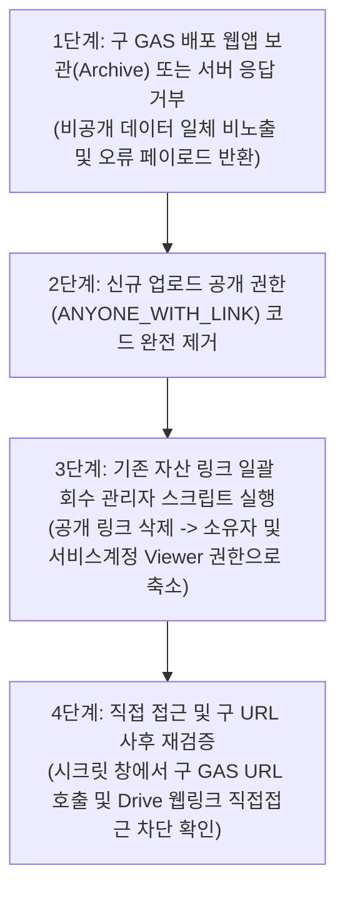
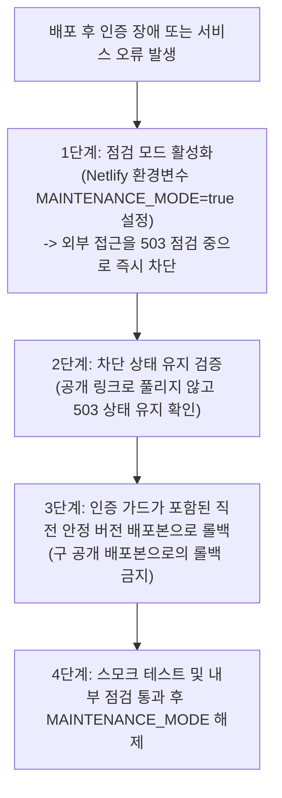

# ANT-003 — 직원 접근 통제 및 내부 아카이브 보안 설계서 (보완 4차)

- **작업 ID**: ANT-003a
- **설계 담당**: 아난티 (Antigravity, Google Pro)
- **메인 오케스트레이터**: 벤 (Ben)
- **작업 브랜치**: `antigravity/ANT-003a-staff-archive-design`
- **기준 커밋**: `origin/master` (`ae4de0e`, BEN-013 기준)
- **작성 일자**: 2026-10-02
- **문서 상태**: PR #29 벤 3차 설계 검토(Issue Comment ID `5951924765`) 4개 피드백 전수 반영 보완 설계서 (코드 미수정, 순수 문서 PR)

---

## 1. 개요 및 설계 목적

본 문서는 `BEN-008`(공개 범위·아카이브·배포 결정), `BEN-010`(접근 권한 판단), `BEN-013`(직원 접근 설계와 배포 보강), 그리고 PR #29의 벤 3차 검토 의견(`5951924765`)에 따라,
봉플레이 운영시스템(`01_봉플레이_운영시스템/`) 및 업무로그·AI(`04_봉뜨락_업무로그_AI/`) 전반의 **직원 전용 자산(Google Drive 5TB 미디어 아카이브, 운영 업무로그 시트, 경영 실적 원장)**에 대한 **서버 검증 기반 접근 통제(Access Control) 및 비공개 자료 안전 제공 체계**를 수립하는 것을 목적으로 한다.

### 1.1 핵심 문제의식 및 해결 과제
1. **클라이언트 사이드 게스트 모드의 한계**: `01` 운영시스템의 `BongplayAuth`는 브라우저 UI를 가리는 프론트엔드 오버레이 방식에 불과하여, 네트워크 API 직접 호출이나 로컬 스토리지 조작을 원천 차단하지 못함.
2. **04 API의 구조적 취약점**:
   - `04_봉뜨락_업무로그_AI/netlify/functions/api.mjs`의 `checkAccess()`는 `ACCESS_CODE` 환경변수가 비어있으면 모든 요청을 무검증 통과시킴.
   - `GET /api/config`는 인증 전 누구나 볼 수 있는 응답에 비공개 Google 시트 원본 편집 주소(`sheetUrl`)를 그대로 누출함.
3. **Google Apps Script(GAS) 공개 배포 및 My Drive 저장소 할당량 한계**:
   - 기존 공개 GAS 웹 앱 URL 및 `ANYONE_WITH_LINK` 설정 파일이 인터넷상에 여전히 활성화되어 있어 직접 우회 접근 위험이 상존함.
   - Google 서비스 계정은 자체 저장 용량이 0바이트(`storageQuotaExceeded`)이므로, 개인 My Drive 폴더에 서비스 계정 단독으로 파일을 업로드할 수 없음 (Google 공식 스펙).
4. **미디어 제공 경로 및 Netlify 한도**:
   - Apps Script `ContentService`는 바이너리 스트리밍을 지원하지 않으며, 웹앱 이벤트 파라미터(`e`)는 HTTP 요청 헤더(`Authorization`)를 수신할 수 없고 HTTP 상태 코드 임의 변경(200 외)이 불가능함.
   - Netlify 동기 함수는 6MB 응답 버퍼 및 10초 타임아웃 제한이 있으며, 네트워크 지연으로 인해 파일 크기가 작더라도 타임아웃이 발생할 수 있음.
5. **호스트 경계, 04 직접 접근 및 bfcache 노출 위험**:
   - `bongplay.netlify.app` 프록시 도입 후에도 `bongplaychat.netlify.app` 직접 방문 세션이 분리되어 잔존할 수 있음.
   - 공용 단말기에서 브라우저 뒤로가기(bfcache) 시 비동기 검증 전 화면 노출 및 오프라인/네트워크 단절 시 데이터 노출 위험이 있음.

---

## 2. 현행 시스템 취약점 및 서버 계약 정밀 분석 (코드 근거)

### 2.1 04 Netlify Functions (`04_봉뜨락_업무로그_AI/netlify/functions/api.mjs`)

```javascript
// [api.mjs line 920-924] ACCESS_CODE 미설정 시 인증 무조건 통과 (취약점 1)
function checkAccess(env, code) {
  const expected = String(env.ACCESS_CODE || '').trim();
  if (!expected) return; // 구조적 허점: 환경변수 누락 시 모든 보안 검사 생략
  if (String(code || '').trim() !== expected) throw new UserError('접근 코드가 올바르지 않습니다.', 401);
}

// [api.mjs line 940-952] unauthenticated GET /api/config 에서 sheetUrl 선반환 (취약점 2)
if (action === 'config') {
  return json({
    needsAccessCode: Boolean(String(env.ACCESS_CODE || '').trim()),
    sheetUrl: sheetUrl(env), // 구조적 허점: 미인증 상태에서 비공개 스프레드시트 편집 URL 직접 누출
    ...
  });
}

// [api.mjs line 954-957 및 990-992] rows 요청의 실제 처리 위치
if (request.method !== 'POST') return json({ error: '지원하지 않는 요청입니다.' }, 405);
const payload = await request.json().catch(() => ({}));
checkAccess(env, payload.code); // rows는 POST 메서드 제한 및 checkAccess 뒤에 위치함

if (action === 'rows') {
  return json({ rows: await readRows(env), sheetUrl: sheetUrl(env) });
}
```

- **분석 및 개선점**:
  - `rows`는 POST 검사와 `checkAccess` 뒤에 위치하므로 기본적으로 보호되나, `ACCESS_CODE` 환경변수가 미설정되면 무검증 통과되는 치명적 결함이 있음.
  - `GET /api/config`는 인증 전 단계에서 비공개 Google 시트 URL을 선반환하므로 제거 대상임.
  - Netlify ZIP 배포 특성상 외부 npm 의존성을 추가하지 않고 Node.js 내장 `node:crypto` 및 표준 `fetch`로 구현(Zero-dependency)해야 함.

### 2.2 01 운영시스템 인증 (`01_봉플레이_운영시스템/assets/config.template.js`)

```javascript
// [config.template.js line 99-114] verifyOnServer RPC 호출
function verifyOnServer(code) {
  if (!sbUrl || !sbKey) return Promise.reject(new Error('unconfigured'));
  return fetch(sbUrl + '/rest/v1/rpc/verify_staff_access', {
    method: 'POST',
    headers: { ... },
    body: JSON.stringify({ p_access_code: code })
  }).then(function (res) {
    if (!res.ok) throw new Error('http_' + res.status);
    return res.json();
  }).then(function (ok) { return ok === true; }); // 실제 반환값은 단순 boolean
}
```

- **Supabase RPC 계약 (`FINAL_SUPABASE_SETUP.sql` line 714-721)**:
  ```sql
  create or replace function public.verify_staff_access(p_access_code text)
  returns boolean
  language sql security definer as $$
    select private.verify_access_code(p_access_code);
  $$;
  ```
- **분석**:
  - DB 함수 `verify_staff_access`는 단일 `access_code`를 검증하여 단순 `boolean`(`true`/`false`)만 반환함.
  - 직원 식별자(`staff_id`), 권한(`role`) 정보가 없으며, 클라이언트 `localStorage`에 평문 저장하므로 특정 직원 세션 철회가 불가능함.

### 2.3 Google Apps Script 소스코드 및 공개 배포 잔존 위험

```javascript
// [drive-archive.gs line 124, 151, 161] 소스코드 상의 ANYONE_WITH_LINK 설정
file.setSharing(DriveApp.Access.ANYONE_WITH_LINK, DriveApp.Permission.VIEW);
newRoot.setSharing(DriveApp.Access.ANYONE_WITH_LINK, DriveApp.Permission.VIEW);
newFolder.setSharing(DriveApp.Access.ANYONE_WITH_LINK, DriveApp.Permission.VIEW);

// [drive-archive.gs line 88-103] 소스코드 상의 무인증 delete 핸들러
if (action === 'delete' || action === 'deleteFile') {
  var fileId = payload.fileId;
  ...
  var f = DriveApp.getFileById(fileIds[d]);
  f.setTrashed(true); // 소스코드 상에 인증 가드가 부재함
}
```

- **공개 잔존 위험 분석**:
  - Netlify 함수가 새 API로 전환되어 GAS를 호출하지 않더라도, **기존에 배포된 공개 GAS 웹앱 URL(`https://script.google.com/macros/s/.../exec`)은 인터넷상에 활성 상태로 남아있음**.
  - 기존 업로드 과정에서 `ANYONE_WITH_LINK`로 공유된 개별 파일 링크 역시 직접 접근이 가능함.
  - 따라서 신규 프록시 구축뿐만 아니라, **구 배포 비활성화/서버 거부 및 기존 링크 회수 절차**가 반드시 수립되어야 함.

### 2.4 두 실사용 도메인 및 진입점 경계

- **도메인 1 (01 운영시스템)**: `https://bongplay.netlify.app`
- **도메인 2 (04 업무로그/AI)**: `https://bongplaychat.netlify.app`
- **문제점**:
  - `netlify.app`은 Public Suffix List(eTLD)이므로 서브도메인 간 와일드카드 쿠키(`Domain=.netlify.app`) 공유가 브라우저에 의해 거부됨.
  - 프록시 리라이트(`/api/*`)를 적용하더라도 사용자가 `bongplaychat.netlify.app`으로 직접 브라우저 방문할 경우 세션 분리 및 API 직접 우회 위험이 발생함.

---

## 3. 권한 매트릭스 및 개인 신원 검증 아키텍처

### 3.1 개인 신원 검증(Authentication)과 서버 역할 부여(Authorization) 분리

공용 비밀번호 및 수기 이름 선택 방식을 전면 배제하고, 개인별 식별 기반 통제를 구현한다:

1. **개인별 신원 인증 (Identity)**:
   - 각 직원은 고유 식별자(`staff_id`, 예: `sh_hong`, `jy_kim`)와 개인별 비밀번호/PIN으로 신원을 검증받음.
   - 자가가입(Self-signup)은 불허하며, 승인된 직원 명부만 관리자에 의해 사전 등록됨.
2. **서버 역할 부여 (Server-side Role Mapping)**:
   - 클라이언트 요청의 역할을 신뢰하지 않고, 서버(Supabase 또는 Netlify 환경변수/DB)가 보유한 계정 테이블에 따라 역할(`staff`, `admin`)을 결정함.
3. **서버 측 즉시 철회 (Server-side Revocation)**:
   - 직원의 퇴사, 기기 분실, 권한 박탈 시 서버에서 해당 계정의 `is_active = false` 처리하거나 `token_version`을 증가시켜 기발급 세션을 즉시 무효화함.

### 3.2 4대 행위별 권한 통제 표

| 행위 (Action) | 미인증 / 비직원 | 게스트 (고객) | 현장 직원 (Staff) | 관리자 (Admin) | 차단/허용 구현 메커니즘 |
|---|:---:|:---:|:---:|:---:|---|
| **원장·목록·썸네일·원본 조회**<br>(업무로그 시트, 아카이브 11분류) | ❌ 거부 (401) | ❌ 거부 (401) | ⭕ **허용** | ⭕ **허용** | 서버 서명 JWT 검증 + 서비스 계정 기반 Drive API 읽기 |
| **업무로그 저장·사진 업로드**<br>(행 추가, 신규 사진 등록) | ❌ 거부 (401) | ❌ 거부 (401) | ⭕ **허용** | ⭕ **허용** | 개인 식별자(`staff_id`) 로깅 + 비공개 저장 (OAuth/소유자 위임) |
| **파일 삭제 (휴지통 이동)** | ❌ 거부 (401) | ❌ 거부 (401) | ❌ **거부 (403)** | ⭕ **허용** *(방식 대기)* | 역할 검사(`role === 'admin'`) (대표 정책 대기) |
| **직원 권한 부여 / 비밀번호 변경** | ❌ 거부 (401) | ❌ 거부 (401) | ❌ **거부 (403)** | ⭕ **지정 절차** | 대표 직접 승인 및 관리자 전용 절차 |

> [!NOTE]
> 관리자 강제 마감 해제 등 업무 규칙으로 배정되지 않은 특수 권한은 본 설계의 확정 범위에서 제외한다.

---

## 4. 목표 아키텍처 및 미디어 제공 경로 재설계

### 4.1 GAS ContentService 한계 및 보조 경로 완전 제거

- **Google 공식 문서 확인 ([Apps Script ContentService](https://developers.google.com/apps-script/guides/content), [Web Apps](https://developers.google.com/apps-script/guides/web))**:
  1. `ContentService`는 `createTextOutput()` 텍스트만 지원하며 **바이너리 Blob 스트리밍을 지원하지 않음**.
  2. Apps Script 웹앱 이벤트 객체 `e`(`doGet(e)`, `doPost(e)`)에는 `e.queryString`, `e.parameter`, `e.postData` 등만 포함되며, **HTTP 요청 헤더(`Authorization` 등)에 접근할 수 있는 API가 일체 제공되지 않음**.
  3. `ContentService` 응답은 기본적으로 HTTP Status 200으로 반환되며, 서버 오류나 접근 거부 시에도 임의의 HTTP 상태 코드(예: 401, 403, 500)를 명시적으로 지정할 수 없음.
- **아키텍처 결정**:
  - "HTTP Authorization 헤더로 시크릿을 검증하는 GAS 보조 경로"는 기술적으로 불가능하므로 **GAS 미디어 조회 보조 경로를 전면 제거**한다.
  - 모든 비공개 미디어 조회는 Netlify Function이 Google Drive API v3를 직접 호출하여 바이너리를 스트리밍하는 **단일 표준 경로**로 통일한다.

### 4.2 서비스 계정의 개인 My Drive 업로드 소유권 및 할당량(Quota) 해결 방안

- **Google 공식 문서 한계 명시 ([Drive API Errors - storageQuotaExceeded](https://developers.google.com/workspace/drive/api/guides/handle-errors#storageQuotaExceeded))**:
  - Google 서비스 계정(Service Account)은 GCP 프로젝트에 종속된 시스템 계정으로, **기본 저장 용량(Storage Quota)이 0바이트**이다.
  - 개인 Google 계정(무료/개인 My Drive)의 폴더에 서비스 계정이 `files.create`로 파일을 업로드하면, **생성된 파일의 소유자가 서비스 계정 자신으로 지정되어 즉시 `storageQuotaExceeded` 오류(403)가 발생**한다.
  - 기존에 Google Sheets API 키나 서비스 계정 키가 존재한다는 사실만으로 Google Drive 업로드가 가능하다고 확정할 수 없다.

- **읽기(Read)와 쓰기(Write)의 인증 주체·Scope·최소 공유 분리**:

| 구분 | 인증 주체 | OAuth Scope | 대상 자산 최소 공유 설정 | 저장소 할당량(Quota) 영향 |
|---|---|---|---|---|
| **읽기 (Read)**<br>원장·썸네일·미디어 조회 | Google 서비스 계정 (`api.mjs` 내장 키) | `https://www.googleapis.com/auth/drive.readonly` | 기존 아카이브 루트 폴더에 서비스 계정을 **뷰어(Viewer)**로만 초대 | 영향 없음 (읽기는 Quota를 소모하지 않음) |
| **쓰기 (Write)**<br>신규 사진·업무로그 파일 업로드 | **기존 My Drive 소유자 위임** | `https://www.googleapis.com/auth/drive.file` (최소 권한) | 기존 소유자의 My Drive 내 업로드 폴더 | **기존 개인 계정의 My Drive 용량 정상 사용** |

- **쓰기(업로드) 구현 대안 및 준비 절차**:
  > [!IMPORTANT]
  > 아래 방안 A(OAuth 2.0 사용자 위임)는 향후 구현을 위한 아키텍처 준비 계획 단계일 뿐이며, 운영 Google 계정의 실제 승인 및 Refresh Token 발급은 대표/벤에 의해 아직 승인되지 않았습니다. 승인 전까지 운영 환경변수 등록이나 실제 키 발급은 착수하지 않습니다.

  - **[권장] 방안 A: 사용자 위임 OAuth 2.0 (User Delegated OAuth with Refresh Token)**
    - *개념*: 기존 My Drive 소유 계정으로 GCP 콘솔에서 OAuth 2.0 Client ID를 발급받고, 1회 승인을 통해 획득한 `Refresh Token`을 Netlify 환경변수에 보관. 파일 업로드 시 소유자 명의의 Access Token을 발급받아 업로드하여 파일 소유권을 소유자에게 귀속시킴.
    - *준비 절차*:
      1. 기존 GCP 프로젝트에서 OAuth 동의 화면(내부/테스트) 구성.
      2. OAuth 2.0 클라이언트 ID 및 Secret 발급.
      3. 소유자 계정으로 1회 인증 스크립트 실행하여 `GOOGLE_OAUTH_REFRESH_TOKEN` 추출.
      4. Netlify 환경변수(`GOOGLE_OAUTH_CLIENT_ID`, `GOOGLE_OAUTH_CLIENT_SECRET`, `GOOGLE_OAUTH_REFRESH_TOKEN`) 등록.
  - **[보존 대안] 방안 B: 소유자 실행 주체(Execute as: Me) GAS 비공개 업로더 유지**
    - *개념*: 파일 생성 시 `Session.getEffectiveUser()`(소유자 계정) 컨텍스트로 동작하는 GAS 웹앱의 업로드 로직을 유지하되, 공개 배포를 닫고 내부 전용 POST 요청(Body 내 서명된 토큰 검증)으로만 제한.
    - *주의*: 신규 OAuth 승인 절차가 대표에 의해 보류될 경우에 한해 검토하며, 읽기 경로는 Drive API v3로 완전히 분리.

### 4.3 Netlify 공식 한도(동기 버퍼 vs 스트리밍) 비교 및 용량 방침

- **Netlify 공식 함수 스펙 비교 ([Netlify Functions Overview](https://docs.netlify.com/build/functions/overview/))**:

| 비교 항목 | 동기 버퍼 함수 (Synchronous Buffered) | 스트리밍 함수 (Streaming `stream()`) |
|---|---|---|
| **응답 전달 방식** | 전체 응답 본문을 메모리에 버퍼링한 후 일괄 전송 | 청크(Chunk) 단위로 클라이언트에 순차 스트리밍 |
| **응답 본문 크기 제한** | **최대 6MB** (초과 시 413 Payload Too Large / 함수 실패) | 6MB 버퍼 제한 우회 가능 |
| **실행 타임아웃** | 기본 10초 (설정 시 최대 26초 연장 가능) | 기본 10초 (동기 한도와 동일하게 적용) |
| **외부 지연 리스크** | Drive API 다운로드 지연 시 10초 초과 실패 | 첫 청크 전송은 빠르나 전체 스트림 지연 시 동일 위험 |
| **플랜 의존성** | Free Starter / Pro 공통 적용 | Netlify 공식 기능(2023+ 도입), 플랜별 대역폭 확인 필요 |
| **용량 확정 방침** | **용량 약속 미확정**: 현재 팀의 실제 Netlify 플랜(Free Starter vs Pro)이 공식 확인되지 않았으므로 임의의 용량 보장은 불가함. 일상 업무 조회는 수십~수백 KB 수준의 **최적화 썸네일(`thumbnailLink`)** 및 웹 최적화 이미지(< 2MB)로 한정하고, 대용량 원본(5MB 초과)은 벤 기술 검토 대기 항목으로 격리함. |

- **지연 방어 대책**:
  1. Netlify 함수 내부에서 `AbortController` 타임아웃을 8초로 설정하여, 10초 강제 종료 전에 안전한 504 Gateway Timeout JSON 에러를 반환.
  2. 프론트엔드 이미지 컴포넌트에 타임아웃/오류 발생 시 자동 재시도 및 플레이스홀더 표시 로직 적용.

---

## 5. 도메인 통합, 세션 보안, 차단 전환 및 복구

### 5.1 두 호스트 통합, 서버 인증(Primary Guard) 및 04 직접 접근 차단

`Origin` 및 `Referer` 헤더는 스크립트나 외부 호출자가 위조 가능한 요청 정보이므로 **절대 서버 인증을 대체할 수 없다**. 따라서 모든 API는 유효 세션 검증을 최우선으로 적용한다:

1. **서버 인증 최우선 원칙 (Primary Guard)**:
   - 모든 API 엔드포인트는 서버 서명 토큰(JWS) 및 역할(`role`)의 유효성을 1차 검증(Primary Guard)하는 것이 필수이다.
   - `Origin` 및 `Referer` 헤더 검사는 브라우저 환경에서의 CSRF 방어 및 비허가 출처 임베딩을 차단하기 위한 2차 보조 방어(Defense-in-depth)로만 사용한다.
   - **합성 시험 조건 (Negative Test)**:
     - 유효한 세션 토큰이 없는 요청에 대해, 설령 헤더에 올바른 Origin(`https://bongplay.netlify.app`) 및 Referer를 위조하여 첨부하더라도 **서버가 반드시 401 Unauthorized로 거부**하는 음성 시험을 필수 검증 항목으로 명시한다.
2. **단일 출처 프록시 리라이트 선언**:
   ```text
   # [bongplay.netlify.app/_redirects]
   /api/*  https://bongplaychat.netlify.app/api/:splat  200!
   ```
3. **04 호스트(`bongplaychat.netlify.app`) 직접 방문 세션 처리**:
   - **04 UI 직접 접속 차단**: 브라우저에서 `https://bongplaychat.netlify.app`으로 직접 접속할 경우, 단일 표준 포털인 `https://bongplay.netlify.app`으로 즉시 HTTP 301/302 리다이렉트하거나 차단 화면을 표시.
   - **직접 API 거부**: `api.mjs`에서 `Origin` 및 `Referer`를 검사하여 `https://bongplay.netlify.app` 출처가 아닌 직접 호출 요청을 403 Forbidden으로 거부.
4. **Set-Cookie 전달 및 로그아웃 동기화**:
   - 프록시 응답 시 `Set-Cookie` 속성은 `SameSite=Lax; Path=/; HttpOnly; Secure`로 설정하여 프록시 호스트 브라우저에 단일 세션 쿠키로 바인딩.
   - 로그아웃 요청(`/api/auth/logout`) 시 세션 쿠키 만료(`Max-Age=0`) 헤더를 발행하여 브라우저에서 즉시 파기.

### 5.2 디지털 서명 토큰(JWS) 및 강건한 bfcache 은닉 방어

1. **서명 토큰(JWS) 및 서버 철회**:
   - HMAC-SHA256 디지털 서명 토큰을 사용하며, 페이로드에 `{ sub, role, token_version, jti, exp }` 포함.
   - 서버 DB/환경변수의 `token_version` 불일치 시 API 호출 즉시 401 Unauthorized 반환.
2. **강건한 bfcache (Back-Forward Cache) 노출 차단**:
   - 브라우저 뒤로가기 시 메모리에 캐시된 DOM이 비동기 확인 전 순간 노출(FOUC)되거나, 네트워크 단절 시 노출된 채로 유지되는 결함을 원천 차단:
     1. **복원 즉시 전면 은닉 (Immediate Masking)**: `pageshow` 이벤트에서 `event.persisted === true`인 경우, 비동기 검증 호출 이전에 **즉시 민감 자료 컨테이너를 숨김 처리(`display: none !important`)**하고 로딩 마스크 표시.
     2. **네트워크 단절 및 실패 시 지속 은닉 (Fail-Closed Offline Defense)**: 세션 재검증 API가 401/403을 반환하거나, **오프라인/네트워크 단절(Catch: NetworkError/Timeout)**이 발생한 경우 자료를 절대 복원하지 않고 계속 숨긴 상태로 즉시 로그인 페이지로 강제 이동(`location.replace('/pages/login.html')`).

```javascript
// [01 운영시스템 직원 페이지 bfcache 방어 코드]
window.addEventListener('pageshow', function (event) {
  if (event.persisted) {
    // 1. 비동기 호출 전 즉시 모든 민감 DOM 은닉 (Information Flash 방지)
    document.querySelectorAll('.staff-sensitive-data').forEach(function (el) {
      el.style.setProperty('display', 'none', 'important');
    });
    var overlay = document.getElementById('session-verifying-overlay');
    if (overlay) overlay.style.display = 'flex';

    // 2. 서버 세션 재검증 수행
    fetch('/api/auth/session-check', { cache: 'no-store' })
      .then(function (res) {
        if (!res.ok) throw new Error('session_invalid');
        // 검증 성공 시에만 은닉 해제
        document.querySelectorAll('.staff-sensitive-data').forEach(function (el) {
          el.style.display = '';
        });
        if (overlay) overlay.style.display = 'none';
      })
      .catch(function () {
        // 검증 실패 또는 오프라인/네트워크 단절 시 절대 노출하지 않고 로그인 화면 이동
        window.location.replace('/pages/login.html');
      });
  }
});
```

### 5.3 Google Drive API v3 기반 일관된 허용 루트 계층 검사 (Zero-dependency)

외부 npm 의존성(`googleapis`)을 일체 사용하지 않고, Node.js 내장 `fetch`로 Google Drive API v3를 직접 호출하여 계층을 검증한다.
또한 **초기 구현에서는 캐시를 전면 배제하고 매 요청 실시간으로 부모 계층을 전수 검증하는 보수적(Fail-Closed) 방식**을 확정한다:

```javascript
// [04 Netlify Functions api.mjs - Drive API v3 기반 실시간 루트 검사]
// 외부 npm 의존성 없음 (Zero-dependency: Node.js 내장 fetch 및 표준 URL 사용)

/**
 * Google Drive API v3 기반 파일의 아카이브 루트 하위 속성 실시간 검증
 * @param {string} accessToken - 서비스 계정 OAuth2 Bearer Access Token
 * @param {string} fileId - 대상 파일 ID
 * @param {string} rootFolderId - 공식 아카이브 루트 폴더 ID
 * @returns {Promise<boolean>}
 */
export async function isFileInArchiveRoot(accessToken, fileId, rootFolderId) {
  const MAX_DEPTH = 6;
  const visited = new Set(); // 요청 단위 순환 참조(Cycle) 방어

  try {
    // 1. 대상 파일 메타데이터 조회
    const fileUrl = `https://www.googleapis.com/drive/v3/files/${encodeURIComponent(fileId)}?fields=id,name,mimeType,parents&supportsAllDrives=false`;
    const res = await fetch(fileUrl, {
      headers: { 'Authorization': `Bearer ${accessToken}` }
    });
    if (!res.ok) return false;

    const file = await res.json();

    // 바로가기(Shortcut) 파일 원천 차단
    if (file.mimeType === 'application/vnd.google-apps.shortcut') {
      return false;
    }

    let currentParents = file.parents || [];
    let depth = 0;

    // 2. 부모 폴더 계층을 상향 실시간 추적 (캐시 배제, Fail-Closed)
    while (currentParents.length > 0 && depth < MAX_DEPTH) {
      const nextLevelParents = [];

      for (const parentId of currentParents) {
        if (parentId === rootFolderId) {
          return true; // 공식 루트 폴더 도달 확인!
        }

        if (visited.has(parentId)) continue; // 순환 방어
        visited.add(parentId);

        const parentUrl = `https://www.googleapis.com/drive/v3/files/${encodeURIComponent(parentId)}?fields=id,parents&supportsAllDrives=false`;
        const pRes = await fetch(parentUrl, {
          headers: { 'Authorization': `Bearer ${accessToken}` }
        });
        if (!pRes.ok) continue;

        const parentFolder = await pRes.json();
        if (parentFolder.parents && parentFolder.parents.length > 0) {
          nextLevelParents.push(...parentFolder.parents);
        }
      }

      currentParents = nextLevelParents;
      depth++;
    }

    return false; // 최대 깊이 내 루트 미도달 시 접근 거부
  } catch (err) {
    return false; // 네트워크 오류 또는 파일 미존재 시 Fail-Closed 거부
  }
}
```

### 5.4 기존 공개 GAS 배포 및 개별 파일 링크 차단/전환 순서 (준비 계획, 운영 미승인)

> [!IMPORTANT]
> 본 단계는 운영 배포 및 라이브 설정 변경 승인이 아니며, 후속 적용을 위한 순차적 전환 절차 계획이다.



1. **1단계 (구 GAS 웹앱 비활성화 및 비공개 자료 비노출)**:
   - Google Apps Script의 `ContentService.createTextOutput()`은 HTTP 응답 상태 코드를 임의로 변경할 수 없으므로, HTTP 상태 코드가 아닌 **실제 응답 본문에서 비공개 스프레드시트/드라이브 데이터가 일체 반환되지 않고 `{ error: "Access Denied" }` 에러 페이로드만 반환되는지 검증**한다.
   - 또한 Google Apps Script 배포 관리에서 과거 활성 배포(Deployment ID)를 보관(Archive) 처리하거나 프로젝트 공유를 "나만(Only myself)"으로 축소하여 Google 기본 인증 화면이 외부 무인증 요청을 원천 차단하도록 처리한다.
2. **2단계 (업로드 로직 공개 공유 제거)**:
   - `file.setSharing(DriveApp.Access.ANYONE_WITH_LINK, ...)` 코드를 영구 삭제하고, 비공개 상태(소유자 기본값)로만 저장되도록 확정.
3. **3단계 (기존 자산 공개 링크 일괄 회수)**:
   - 기존 아카이브 내 파일 및 폴더에 부여된 `ANYONE_WITH_LINK` 권한을 회수하는 관리자 일회성 스크립트를 승인 후 실행.
   - 접근 권한을 "소유자 계정" 및 "읽기 프록시용 서비스 계정(Viewer)"에게만 한정.
4. **4단계 (직접 접근 사후 재검증 절차)**:
   - ① 미인증 상태에서 구 GAS 웹앱 URL 호출 시 비공개 자료 비노출 및 에러 페이로드 반환 확인.
   - ② 기존 파일의 Google Drive 직접 웹 링크 접근 시 "액세스 권한 필요" 차단 화면 확인.
   - ③ 오직 직원 인증을 거친 Netlify 프록시 엔드포인트를 통해서만 미디어가 반환되는지 확인.

### 5.5 차단 유지 복구 순서 (Fail-Closed Rollback)

장애 발생 시 구 공개 버전으로 무조건 롤백하여 보안 통제를 되돌리는 행위를 절대 금지하며, 반드시 차단 상태를 유지하는 복구 절차를 수행한다:



---

## 6. 고객 공개 화면 및 기존 원본 데이터 보존

1. **고객 공개 4대 화면 완전 격리**:
   - `pages/consent.html`, `pages/booking.html`, `pages/survey.html`, `index.html`은 `BONGPLAY_GUEST_MODE = true`를 유지하며 이번 직원 접근 통제 변경의 영향을 일체 받지 않음.
2. **11개 아카이브 분류 체계 및 5TB 원본 보존**:
   - 드라이브 내 기존 11개 분류 폴더와 원본 파일은 그대로 보존하며, 복사/이동/재적재를 일체 수행하지 않음.

---

## 7. 의사결정 사항 및 독립 보안 제안 (정리)

### 7.1 대표 판단 필요 사항 (실제 질의 2건)
- **[대표 정책 1] 공개 직원 연락처 제거 여부**: 운영시스템 및 화면에서 직원 실명 및 개인 연락처 노출을 완전히 제거/마스킹할지 여부.
- **[대표 정책 2] 비공개 보관 폴더 vs 휴지통 삭제 방식**: 관리자 파일 삭제 시 완전 휴지통 이동(30일 보존 후 영구삭제) vs 비공개 격리 보관 폴더 이동(영구 보존) 여부.

### 7.2 별도 신규 보안 제안 (아난티 제안, 미배정 과업)
- **[신규 제안 1] 방문 고객 얼굴 마스킹 및 동의서 개인정보 비식별화 방안**:
  - *배경*: 아카이브 내 현장 사진의 고객 초상권 보호 및 서약서·동의서 내 주민번호/전화번호 비식별화 필요성.
  - *상태*: 현재 대표 질문으로 상정되지 않은 아난티의 독자적 신규 제안이며, 본 ANT-003 과업의 확정 범위에 포함하지 않고 향후 고도화 검토 안건으로 분리 유지.

### 7.3 벤(Ben) 기술 검토 사항 (기술 실현성)
- **[벤 기술 검토 1] 5MB 초과 대용량 원본 파일 제공 방식**: Netlify 6MB 버퍼 및 타임아웃 한계에 따른 대용량 원본 파일의 안전한 전달 경로(일회성 사용자 위임 OAuth 다운로드 링크 vs 사전 승인된 Google Drive 내부 직접 공유).
- **[벤 기술 검토 2] 개인별 자격증명 DB 스키마 및 OAuth Refresh Token 관리**: Supabase 내 직원 인증 스키마 확정 및 소유자 OAuth Refresh Token 환경변수 보관 승인 (준비 계획이며 실계정 승인/발급 전 상태).
